# 인사 관리 ERP 어플리케이션 사람숲 

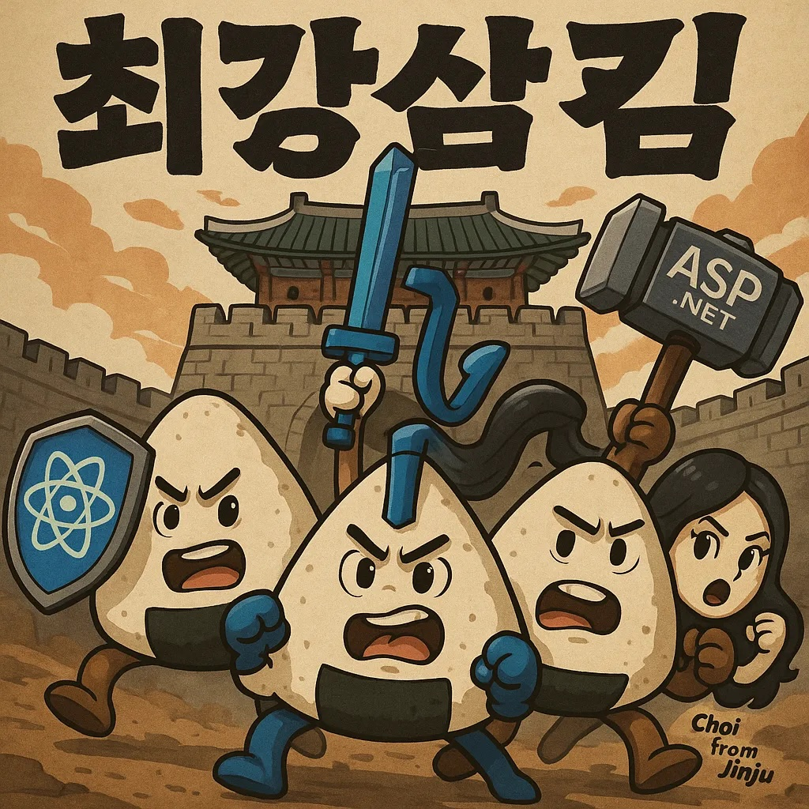 

## 목차
- [기획서 및 개발 문서](#기획서-및-개발-문서)
- [프로젝트 개요](#프로젝트-개요)
  - [인원 소개 (4명)](#인원-소개-4명)
  - [일정](#일정)
  - [제작 배경](#제작-배경)
  - [기술 스택](#기술-스택)
  - [주요 기능](#주요-기능)
- [프로젝트 구조](#프로젝트-구조)
  - [레이아웃 구성](#레이아웃-구성)
  - [폴더 구조](#폴더-구조)
  - [DB 구조](#db-구조)
- [개인 역할](#개인-역할)
  - [김민혁](#김민혁)
  - [김성훈](#김성훈)
  - [김한석](#김한석)
  - [최영비](#최영비)

<br>

## 기획서 및 개발 문서


1. [🔗 작업 로그 노션 ](https://universal-gallium-010.notion.site/2059b2f7b0af804f870feea9b6471448?source=copy_link)
2. [🔗 개발 기획서](https://docs.google.com/presentation/d/1cj48KtGpLL-fApoqQQtzJOlXoqCeXz00Ee7nb3GiBJg/edit?usp=sharing)
2. [🔗 기능 정의서](https://docs.google.com/spreadsheets/d/1S5rjBWc9SJgxgCSC1vVOIM7l-SeXTmkS1t6vcMo8n_g/edit?gid=0#gid=0)
3. [🔗 DB 구조 및 ERD](https://dbdiagram.io/d/684f63793cc77757c8f86fe8)
4. [🔗 협업 규칙](docs/cowork_rule.md)
5. [🔗 피그마](https://www.figma.com/design/A4J6j9Wokzh3biuYxfpDQs/%EC%82%AC%EB%9E%8C%EC%88%B2_%EC%95%B1_%EB%94%94%EC%9E%90%EC%9D%B8?node-id=0-1&t=93PXqXVUEyUP5VSy-1)

---

## 프로젝트 개요

### 인원 소개 (4명)

|이름|깃 포크 주소|
| --- | --- |
| 김성훈 | https://github.com/tony96kimsh/saramsoop_Tony |
| 김민혁 | https://github.com/kmh8405/KMH_saramsoop |
| 김한석 | https://github.com/hanseok0621/saramsoop_hs |
| 최영비(메인 스트림 담당) | https://github.com/cyeongb/saramsoop |

### 일정
```
5주: 2025.06.11(수) ~ 2025.07.16(수)
```

### 제작 배경
우리 팀은 실무에 가까운 개발 경험을 쌓는 것을 목표로 삼아, 많은 기업에서 실제로 활용되는 ERP 시스템에 주목하게 되었습니다. 특히 그중에서도 **인사(HR) 시스템은 조직의 핵심 운영과 밀접하게 연관되어 있고, 다양한 업무 시나리오와 데이터 흐름을 담을 수 있다는 점**에서 높은 학습 효과를 기대할 수 있다고 판단했습니다.

팀원 모두가 효율적인 시스템 설계와 사용자 중심의 UX에 관심이 있어, 단순한 CRUD를 넘어 실질적인 업무 흐름을 반영한 ERP 인사 시스템을 구현하고자 의기투합했습니다. 이 프로젝트는 단순한 기능 구현을 넘어서, 실제 현업에서 활용 가능한 **ERP 구조와 기능에 대한 이해를 높이고자 하는 공동의 목표**를 담고 있습니다.

### 기술 스택

#### 프론트엔드

- ,   
  → 컴포넌트 기반의 UI 구성에 최적화되어 있어 생산성과 유지보수성 향상  
-   
  → 정적 타입 지원으로 안정성 있는 코드 작성 가능  
-   
  → 빠르고 일관된 디자인 시스템을 제공하는 UI 프레임워크

#### 백엔드
-   
  → 강력한 객체지향 언어로, 대규모 시스템 개발에 적합  
-   
  → 보안과 성능이 뛰어난 웹 프레임워크로 REST API 서버 구축에 사용  
-   
  → 데이터베이스 연동을 객체지향적으로 다룰 수 있어 개발 효율이 높음

#### 데이터베이스
-   
  → 안정성과 확장성이 뛰어난 오픈소스 RDBMS로 기업에서도 많이 사용됨  
-   
  → SQL 시각화 및 관리에 편리한 툴로 로컬 개발에 활용


### 주요 기능

1. **JWT 기반 인증 및 보안**
   - 사용자 로그인 시 JWT(JSON Web Token)를 발급하고, 프론트에서 이를 저장해 인증 처리
   - 비밀번호는 SHA 해시 알고리즘으로 암호화 저장 및 검증

2. **직원/근태/결재 등 ERP 핵심 기능 구현**
   - 사용자(직원) 등록, 수정, 삭제 (CRUD)
   - 근태 기록 등록, 수정, 조회 (출근, 지각, 조퇴, 병가 등)
   - 휴가 신청 및 승인 프로세스 구현 (결재 요청 → 상태 변경)
   - 연차 정보 관리 (연차 총합, 사용일, 잔여일)

3. **프론트엔드 UI 및 UX**
   - React 기반의 컴포넌트 구조화
   - MUI(Material UI)로 직관적인 관리자 화면 구현
   - 페이지 간 라우팅 및 동적 데이터 처리

4. **ASP.NET 백엔드 및 데이터 연동**
   - MVC 아키텍처를 기반으로 Controller, Service, Model 분리
   - Entity Framework를 통해 PostgreSQL 데이터베이스와 객체지향적으로 연동
   - RESTful API로 프론트와 데이터 통신 처리

5. **PostgreSQL을 활용한 관계형 데이터베이스 설계**
   - 직원(users), 부서(departments), 직급(positions), 근태(attendance), 연차(personal_leave), 결재(approvals), 휴가신청(leave_request) 테이블 구성
   - 외래키, 인덱스, 제약조건 등을 통한 무결성 확보

6. **더미 데이터와 ERD 기반 테스트 및 시나리오 검증**
   - 다양한 직급/부서/역할을 반영한 더미 데이터 10건 이상 삽입
   - 업무 흐름에 맞는 테스트 시나리오 검증 (출근, 지각, 병가, 휴가 승인 등)

7. **모듈화된 폴더 구조와 확장 가능성**
   - 프론트: `components`, `pages`, `services`, `hooks` 등 모듈 단위 구성
   - 백엔드: `Controllers`, `Models`, `Services`, `Data` 등 분리된 책임 기반 구조


---

## 프로젝트 구조

### 스타일가이드


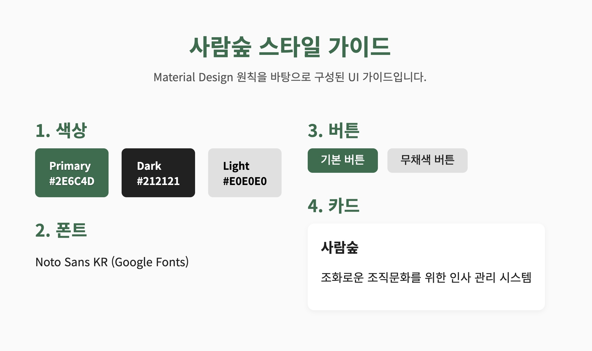 | 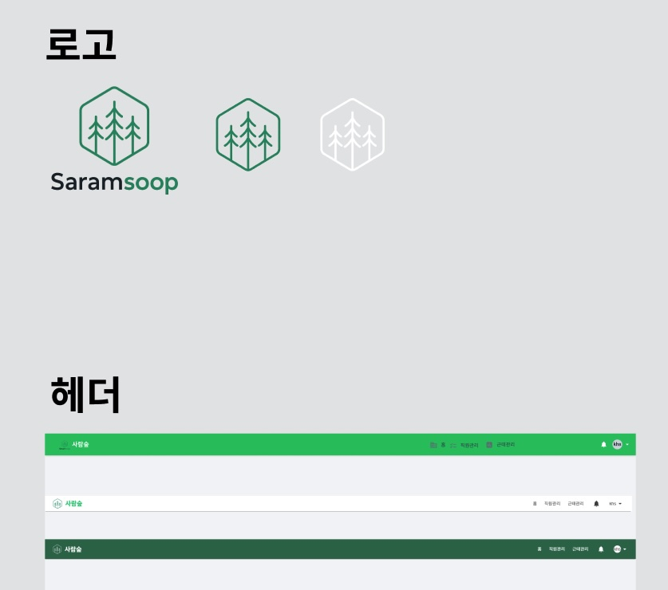
--|--|

### 레이아웃 구성

#### 홈
로그인 | 홈
--|--|
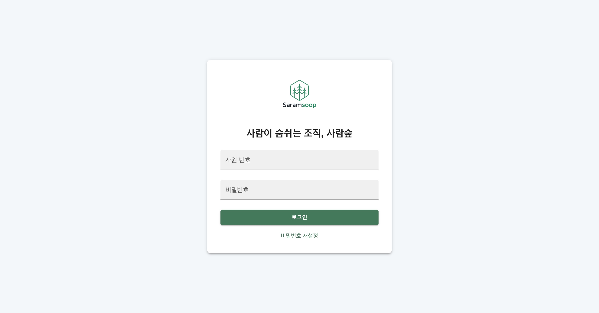 | 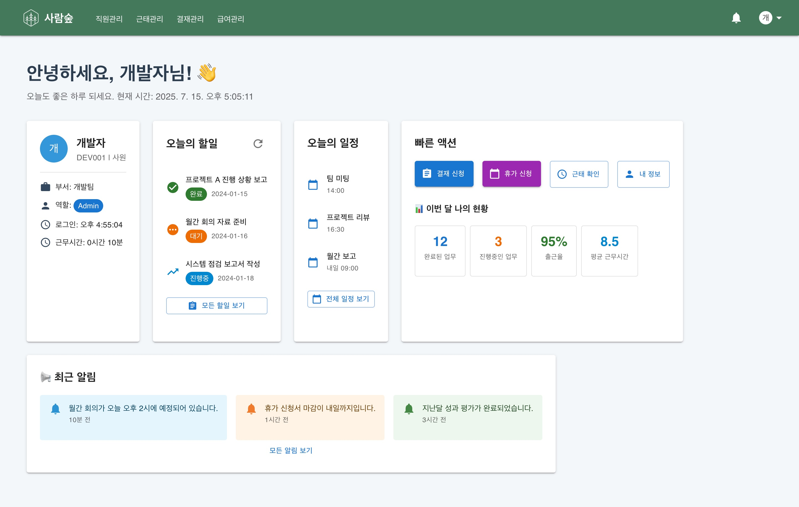


#### 직원관리 

직원관리 | 직원상세
--|--|
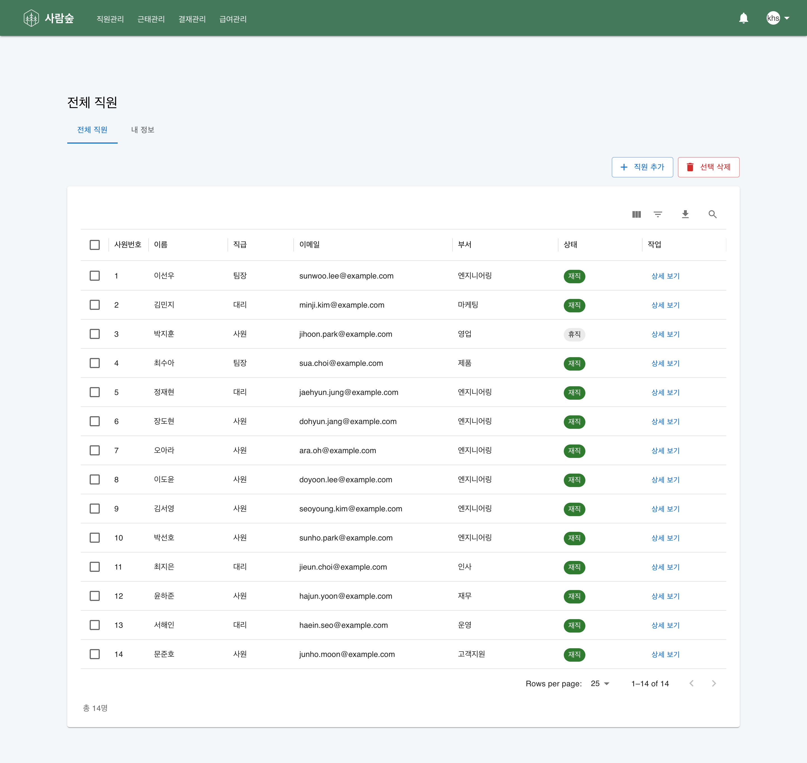 | 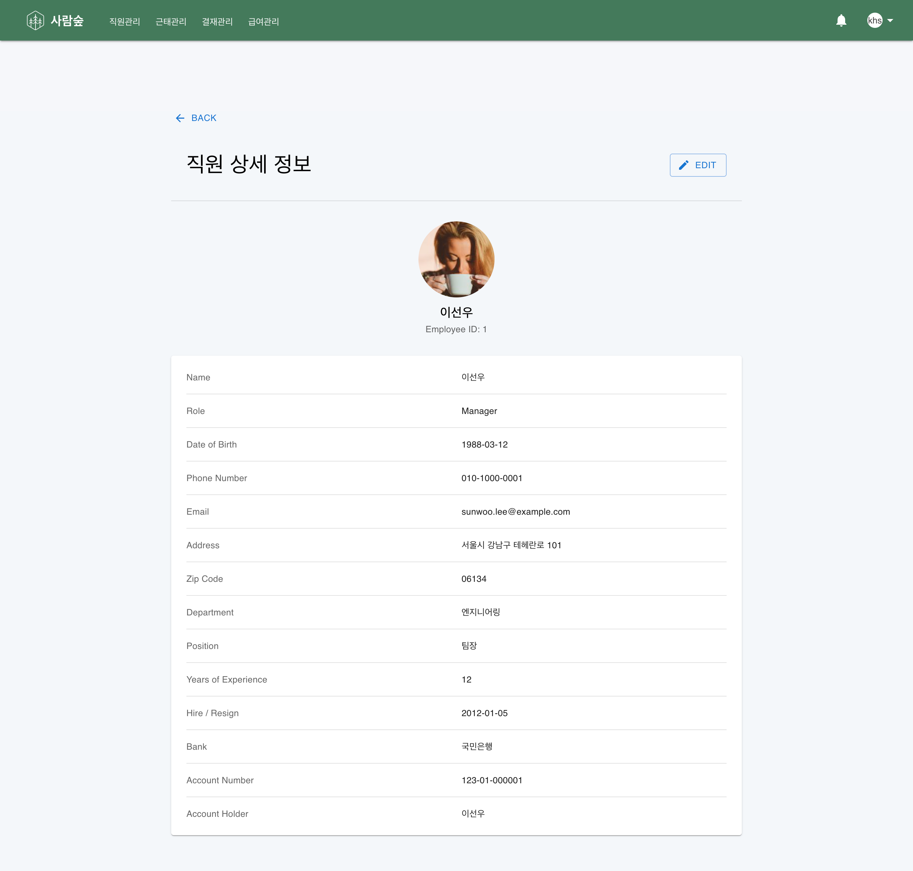


#### 근태관리 
근태관리 | 근태 상세
--|--|
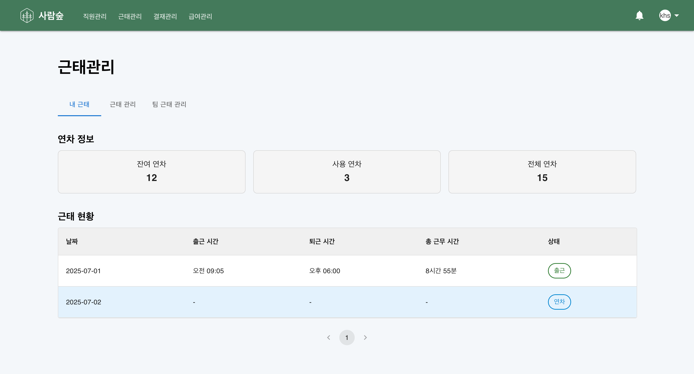 | 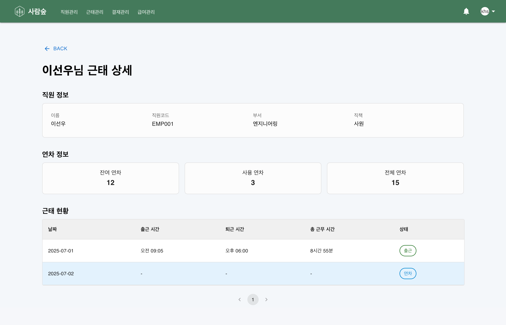 


#### 결재관리
결재관리 | 결재신청
--|--|
 | 

### 폴더 구조
```
Saramsoop/
├── Backend/
│   ├── Controllers/          # API 엔드포인트
│   ├── Models/              # 데이터 모델 및 DTO
│   ├── Services/            # 비즈니스 로직
│   ├── Data/                # 데이터베이스 관련
│   ├── Utils/               # 유틸리티
│   └── Program.cs           # 애플리케이션 진입점
└── Frontend/
    ├── src/
    │   ├── components/      # 재사용 가능한 UI 컴포넌트
    │   ├── pages/          # 페이지 컴포넌트
    │   ├── services/       # API 통신
    │   ├── types/          # TypeScript 타입
    │   ├── hooks/          # 커스텀 훅
    │   ├── contexts/       # Context API
    │   ├── utils/          # 유틸리티 함수
    │   └── styles/         # 스타일 파일
    └── package.json

```

### DB 구조

테이블 구조 | 필드 구조 |
--|--|
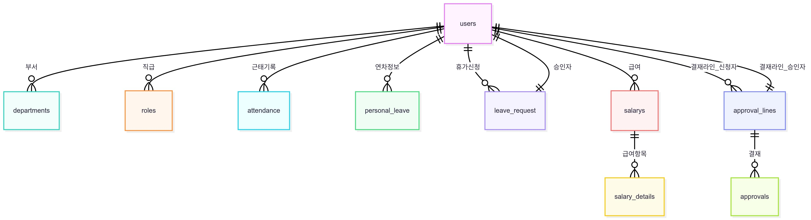| 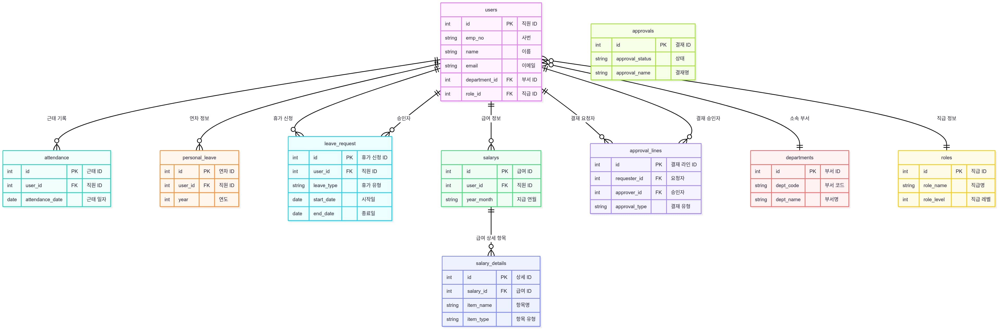

전체 구조 |
--|
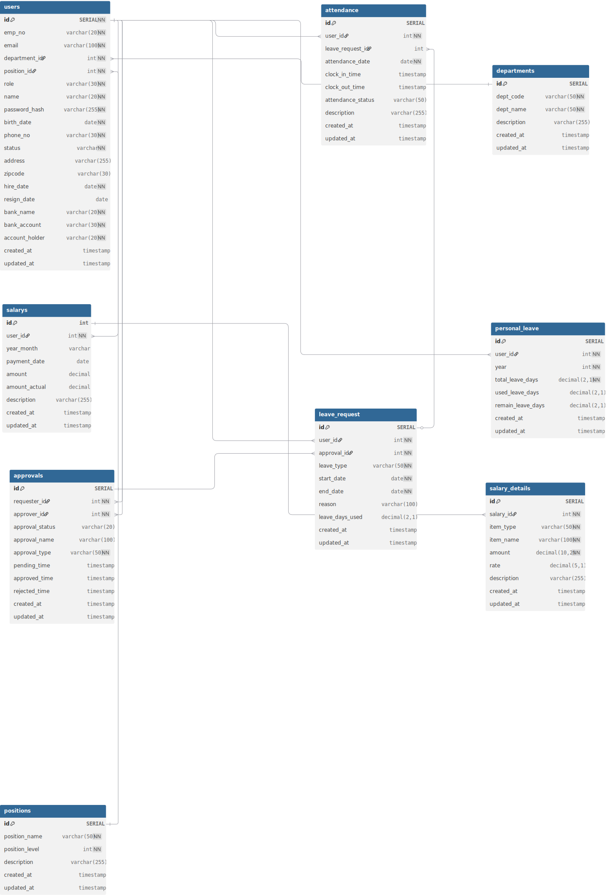


---

## 개인 역할

> 모두가 배우는 입장을 고려하여 기능 중심으로 개인마다 모두 백엔드, 프론트엔드, 마크업을 진행하였습니다.

### 김민혁
- 직원관리: 백엔드 / 프론트엔드

### 김성훈
- 근태관리: 백엔드 / 프론트엔드

### 김한석
- 공통 레이아웃: 헤드 프론트
- 로그인: 백엔드 / 프론트엔드

### 최영비
- 로그인: 백엔드 JWT토큰 연결 및 SHA 해시 알고리즘 구현
- 결재관리: 백엔드 / 프론트엔드